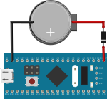
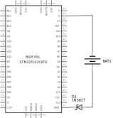

# STM32F1_RTC API Documentation

&nbsp;

## Overview
Allows to use the **RTC** functionalities of **STM32F1xx** based boards using external low speed oscillator (LSE).

This library can be used in the [**STM32 Cores** by **STMicroelectronics**](https://github.com/stm32duino/Arduino_Core_STM32)
as well as in the [**libmaple** version of **Arduino STM32** by **Roger Clark**](https://github.com/rogerclarkmelbourne/Arduino_STM32)
development boards.

With this library you can use the **RTC** device to program actions related to date and time.
This library offers **Islamic Hijri** calendar calculations in addition to the **Christian (Gregorian)** calendar.
Day, month, hour, minute and second parameters can be supplied with values that exceed their respective limits or supplied with negative values.
Other parameters will be adjusted accordingly.

## Hardware Implementation
Per datasheet, If LSE (low speed external oscillator) selected as RTC clock then the RTC continues to work even if the V<sub>DD</sub> supply is switched off,
provided the V<sub>BAT</sub> supply is maintained. V<sub>BAT</sub> can be supplied with 3V external battery such as CR2032 through a Schottky diode.
For example, if using a cheap Blue Pill development board, the connection with the external battery can be seen on ***Fig.1*** or ***Fig.2***.

&nbsp;



***Figure 1.*** *CR2032 external battery connected to the Blue Pill development board*

&nbsp;



***Figure 2.*** *The scheme of Blue Pill development board with CR2032 external battery.*

&nbsp;

It is important to note, if you encounter problems with the clock pulses from LSE source, for example, very slow pulses,
then remove the **PC14** and **PC15** header pins which are directly connected to the STM32F1xx MCU
**OSC32_IN** and **OSC32_OUT** which increases the capacitance effect of the 32.768kHz crystal oscillator.

## Including STM32F1_RTC
You can include `STM32F1_RTC` like this:

```c
#include <stm32f1_rtc.h>
```

## Object
You can create an `STM32F1_RTC` object like this:

```c
STM32F1_RTC rtc;
```

where `rtc` is the instance of `STM32F1_RTC` class.

## Data Structures
`STM32F1_RTC` class using following **`DateVar`**, **`TimeVar`**, and **`DateTime`** struct data types:

```c
struct DateVar {
  uint16_t numberOfDays;
  uint16_t year;
  int16_t  month;
  int16_t  day;
  uint8_t  weekday;
  bool     isLeapYear;
};

struct TimeVar {
  int16_t  hours;
  int16_t  minutes;
  int16_t  seconds;
};

struct DateTime {
  DateVar date;
  TimeVar time;
};
```

* **`DateVar` struct**

  The `DateVar` struct represents a date (Gregorian or Hijri) and it has following members:

  - **`numberOfDays`**

    An unsigned 16-bit integer value represents the number of days that have elapsed since 00:00:00 Thursday, 1 January 1970 (or 22 Syawwal 1389 H).

  - **`year`**

    An unsigned 16-bit integer value represents the full year of the specified date (1970-2105 for Gregorian calendar, or 1389-1529 for Hijri calendar).

  - **`month`**

    A signed 16-bit integer value represents the month in the specified date (1-12).
    1 means January/Muharram, 2 means February/Shafar, ..., and 12 means December/Dhul-Hijjah.
    As input, you can set it value outside the range (-32768 to 32767).
    13 means January/Muharram in the year after, 14 means February/Shafar in the year after,
    24 means December/Dhul-Hijjah in the year after, and so on.
    Whereas 0 means December/Dhul-Hijjah in the year before, -1 means November/Dhul-Qa'dah in the year before,
    -11 means January/Muharram in the year before, and so on.

  - **`day`**

    A signed 16-bit integer value represent the day of the month for the specified date (1 to 28/29/30/31 for Gregorian calendar or 1 to 29/30 for Hijri calendar).
    As input, you can set it value outside the range (-32768 to 32767).
    0 means the last day in the month before, 1 means the second to last day in the month before and so on.

  - **`weekday`**

    An unsigned 8-bit integer value represents the day of the week for the specified date (0-6).
    0 means Sunday/Ahad, 1 means Monday/Ithnayn, ..., 6 means Saturday/Sabt.

  - **`isLeapYear`**

    This value is `true` if the specified date is leap year. Otherwise it value is `false`.
    In Hijri calendar, this value always `false`.


* **`TimeVar` struct**

  The `TimeVar` struct represents a time portion for a specified date and it has following members:

  - **`hours`**

    A signed 16-bit integer value represents the hour for the specified time (0-23).
    As input, you can set it value outside the range (-32768 to 32767) which will affect the number of day of the date portion.

  - **`minutes`**

    A signed 16-bit integer value represents the minutes in the specified time. 
    As input, you can set it value outside the range (-32768 to 32767) which will affect the hour for the specified time.

  - **`seconds`**

    A signed 16-bit integer value represents the seconds in the specified time. 
    As input, you can set it value outside the range (-32768 to 32767) which will affect the minutes in the specified time.


* **`DateTime` struct**

  - **`date`**

    The `DateVar`struct represents the date portion of a specified calendar.

  - **`time`**

    The `TimeVar` struct represents the time portion of a specified calendar.

## Methods
`STM32F1_RTC` class has following methods:
* **`begin()`**

  Begin to use the RTC device. If it has never been initialized, the initialization process will be carried out.

  **Returns:**

  - **`true`** if the RTC device has already been initialized.
  - **`false`** if the RTC device has never been initialized.


* **`init()`**

  Initializes the RTC device.


* **`attachInterrupt(mode, callback)`**

  Sets a function to call on a specific event. There is no need to clear the active flag of related event
  (second flag, or alarm flag, or overflow flag), it will be cleared internally.

  **Parameters:**

  - **`mode`**

    Interrupt mode to use, can be a constant between:

    * **`RTC_SECONDS_INTERRUPT`**

      An occured event every time the RTC counter register incremented.

    * **`RTC_ALARM_INTERRUPT`**

      An occured event when the RTC counter register reaches the threshold set in the RTC alarm register.

    * **`RTC_OVERFLOW_INTERRUPT`**

      An occured event when the RTC counter register overflows (it value is rollback to zero).

  - **`callback`**

    The function to call when the interrupt occurs.


* **`detachInterrupt(mode)`**

  Turns off the given interrupt. **`mode`** parameter is interrupt mode to turn off, can be a constant between:

  * **`RTC_SECONDS_INTERRUPT`**

    An occured event every time the RTC counter register incremented.

  * **`RTC_ALARM_INTERRUPT`**

    An occured event when the RTC counter register reaches the threshold set in the RTC alarm register.

  * **`RTC_OVERFLOW_INTERRUPT`**

    An occured event when the RTC counter register overflows (it value is rollback to zero).


* **`getTime()`**

  Returns an unsigned 32-bit integer value stored in internal RTC counter register.
  This value represents the number of seconds that have elapsed since 00:00:00 Thursday, 1 January 1970 (or 22 Syawwal 1389 H),
  also known as **UNIX Epoch time**.


* **`setTime(epochTime)`**

  Sets the internal RTC counter register with the given **`epochTime`** value.
  **`epochTime`** parameter is unsigned 32-bit integer value represents the number of seconds that have elapsed since 00:00:00 Thursday, 1 January 1970 (or 22 Syawwal 1389 H).


* **`setAlarmTime(epochTime)`**

  Sets the internal RTC alarm register with the given **`epochTime`** value.
  **`epochTime`** parameter is unsigned 32-bit integer value represents the number of seconds that have elapsed since 00:00:00 Thursday, 1 January 1970 (or 22 Syawwal 1389 H).


* **`getMilliseconds()`**

  Returns an unsigned 16-bit integer value as the number of milliseconds elapsed (0-999).


* **`getBackupRegister(index)`**

  Returns an unsigned 16-bit integer value stored on the backup register identified by the given **`index`**.
  **`index`** parameter is unsigned 8-bit integer value as index of backup registers.
  Index value is 1-10 for low-density and medium-density devices of STM32F1xx family MCU,
  or 1-42 for high-density, XL-density, and connectivity-line devices of STM32F1xx family MCU.
  Returns zero if index is out of range.


* **`setBackupRegister(index, value)`**

  Stores a value represents by the given **`value`** on the backup register identified by the given **`index`**.

  **Parameters:**

  - **`index`**

    Unsigned 8-bit integer value as index of backup register.
    Index value is 1-10 for low-density and medium-density devices of STM32F1xx family MCU,
    or 1-42 for high-density, XL-density, and connectivity-line devices of STM32F1xx family MCU.

  - **`value`**

    Unsigned 16-bit integer value to stores on the specified backup register.

  **Returns:**

  - **`true`** if index of backup register is in range.
  - **`false`** if index of backup register is out of range.


* **`isInitialized()`**

  Determines whether or not the RTC device has already been initialized.

  **Returns:**

  - **`true`** if the RTC device has already been initialized.
  - **`false`** if the RTC device has never been initialized.


* **`isCounterUpdated()`**

  Determines whether or not the internal RTC counter register is incremented after the last time of the second event flag cleared.
  This method can be used to polling the incrementation of counter register when the `RTC_SECONDS_INTERRUPT` interrupt is not used.
  If so,`clearSecondFlag()` method must be called afterwards.

  **Returns:**

  - **`true`** if the internal RTC counter register is incremented.
  - **`false`** if the internal RTC counter register is not incremented yet.


* **`isAlarmTriggered()`**

  Determines whether or not the internal RTC counter register has been reached the threshold set in the internal RTC alarm register.
  This method can be used to polling whether the counter register has been reached the threshold set in the alarm register when the `RTC_ALARM_INTERRUPT` interrupt is not used.
  If so,`clearAlarmFlag()` method must be called afterwards.

  **Returns:**

  - **`true`** if the counter register has been reached the threshold set in the alarm register.
  - **`false`** if the counter register has not been reached the threshold set in the alarm register yet.


* **`isCounterOverflow()`**

  Determines whether or not the internal RTC counter register has been overflow (it value is rollback to zero).
  This method can be used to polling whether the counter register has been overflow when the `RTC_OVERFLOW_INTERRUPT` interrupt is not used.
  If so,`clearOverflowFlag()` method must be called afterwards.

  **Returns:**

  - **`true`** if the internal RTC counter register has been overflow.
  - **`false`** if the internal RTC counter register has not been overflow yet.


* **`clearSecondFlag()`**

  Clears the second flag which is set by hardware when the internal RTC counter register incremented.


* **`clearAlarmFlag()`**

  Clears the alarm flag which is set by hardware when the internal RTC counter register has been reached the threshold set in the internal RTC alarm register.


* **`clearOverflowFlag()`**

  Clears the overflowFlag which is set by hardware when the internal RTC counter register has been overflow (it value is rollback to zero).


* **`enableClockInterface()`**

  Enables power and backup clock interfaces. This method must be called after reset before accessing the RTC device. Internally called by `begin()` method.


* **`waitSync()`**

  Waits internal RTC registers synchronized. This method must be called after reset before accessing the internal RTC registers.
  `enableClockInterface()` method must be called first. Internally called by `begin()` method.


* **`enableBackupWrites()`**

  Enable writes to backup and internal RTC registers.


* **`disableBackupWrites()`**

  Disable writes to backup and internal RTC registers.


* **`epochToDate(epochTime, date)`**

  Converts the **UNIX Epoch time** represents by the `epochTime` parameter to a date portion represents by the `date` parameter. 


* **`epochToTime(epochTime, time)`**

  Converts the **UNIX Epoch time** represents by the `epochTime` parameter to a time portion represents by the `time` parameter.


* **`epochToDateTime(epochTime, date, time)`**

  Converts the **UNIX Epoch time** represents by the `epochTime` parameter to date and time portions represent by the `date` and `time` parameters.


* **`epochToDateTime(epochTime, dateTime)`**

  Converts the **UNIX Epoch time** represents by the `epochTime` parameter to a `DateTime` struct represents by the `dateTime` parameter.


* **`dateTimeToEpoch(date, time)`**

  Returns an unsigned 32-bit integer value represents the **UNIX Epoch time** from a specified date and time portions
  that are representing by the `date` and `time` parameters.
  Here each member of `date` and `time` structs will be adjusted accordingly.


* **`dateTimeToEpoch(dateTime)`**

  Returns an unsigned 32-bit integer value represents the **UNIX Epoch time** from a specified `DateTime` struct
  represents by the `dateTime` parameter.


* **`epochToHijriDate(epochTime, date)`**

  Converts the **UNIX Epoch time** represents by the `epochTime` parameter to a Hijri date portion represents by the `date` parameter. 


* **`hijriDateTimeToEpoch(date, time)`**

  Returns an unsigned 32-bit integer value represents the **UNIX Epoch time** from a specified date and time portions
  that are representing by the `date` and `time` parameters.
  Here each member of `date` and `time` structs will be adjusted accordingly.

&nbsp;

&nbsp;

&nbsp;

---
### Created by: ZulNs
#### Gorontalo, 8 September 2019
---
